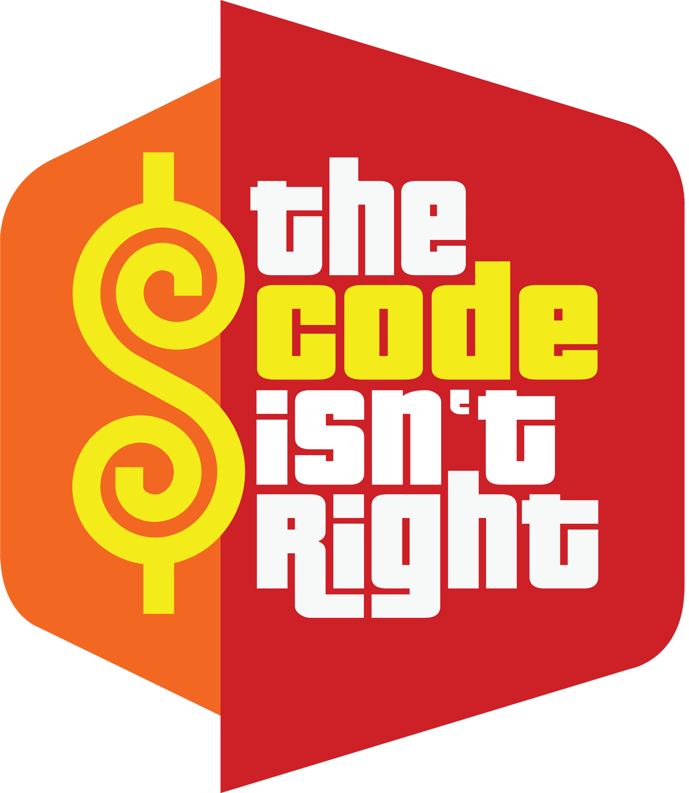

<p align="center">
  
</p>

## ESLint

[ESLint](http://eslint.org/) is a JavaScript linting utility meant to make your life hard and miserable and annoy you in every way possible. Did you think you knew how to code well and the code you're going to compile will work on the first try? Don't worry you're just going to have to fix about 50 errors that ESLint gives you.

Joking aside, since JavaScript is a loosely-written language there are a lot of small things in your code that could cause an error in the future. ESLint will scan your code for parts that may impact your program in the future. It is trying to cement a better way to write code in you. Also ESLint does not require you to execute and compile your code to find the coding errors, it is able to check your code inside your IDE such as IntelliJ.

For example, everyone loves to use i++ because it's simple and works in pretty much every language. But in JavaScript a small difference in whitspace can alter your code in unintended ways.

We expect i++ to do this :

```
let i = 10;
let j = 11;
i++
j
console.log(i , j); // i = 11, j = 11

```

But a simple whitespace left open can actually change a value of a variable you did not intend to change.

```
let i = 10;
let j = 11;
i
++
j
console.log(i , j); // i = 10, j = 12

```
ESLint will parse your code for unary operators and tell you to replace them with stricter rules

```
let i = 10;
let j = 11;
i += 1;
j -= 1;
console.log(i , j); // i = 11, j = 9
```
But when I finally get that green checkmark from ESLint after fixing my entire code, I get a sense of satisfaction knowing it probably won't screw up in the future due to syntax but because of my inability to code correctly.

## My Take on "Coding Standards"

I agree that the most useful software engineering technique to improve quality of your code is coding standards. Since almost every language has some sort of coding standard linter, I don't think there should be any excuse that your code will have problems running in the future because of a small mishap like putting in an extra whitespace. I don't believe that coding standards help you learn how to code but they do help you learn a language. Learning to code and learning to code perfectly in a certain language are two different things. Most code you write will run in some languages but all the code you write will not run perfectly unless you learn the ins and outs of the coding language.

But I do think there is another thing that is very important to learn as a software engineer. It's the ability to organize your code in a clear and concise manner so that when someone else reads you code they don't have to stare at your code for a bare minimum of 500 hours to understand what is going on. Unorganized code is probably my biggest pet peeve in computer science because not only does it make it hard for other people to read your code, but I don't even understand how the person writing it can read it either. 

<p align="center">
  
</p>

<p align="center">
  
</p>
