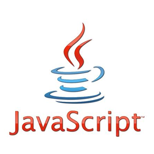

## Learning JavaScript

I started my coding adventure when I was in high school using tools such as CodeCademy learning simple languages like JavaScript and HTML. The languages that I am familar with are Java, C, and C++. Initially JavaScript looked similar to the other object oriented programming languages such as Java and C++ but I quickly learned that it was really different. I was having trouble learning the basics of JavaScript through [FreeCodeCamp](https://www.freecodecamp.com) because of the small syntax differences.

For example in Java, C, and C++, declaring a variable is intuitive :
```
int x = 50;
float y = 40.5;
char z[5] = "hi" ;
```
But in JavaScript you only have three declaration types for all variables :
```
var intX = 50;
let y = 40.5;
const z = ["hi"]; //var, let, and const all have the same meaning, they only define how the variable can be used/modified
```
Althought it seems easier that there is only 1-3 types of initializers, it confuses me sometimes because it is ingrained in my mind to use int, float, etc. from the other languages that I learned before.


## What’s a smart question?

Stack Overflow, a question and answer site for programmers, is a great resource for anyone who may have issues with code or who may simply want to learn new or different methods of doing something. There I found examples of good questions and bad questions, which could probably be improved.

In the following example, we examine the components of a decent question. In this case, the asker is trying to figure out a way to get the date of the previous month in Python.

```
Q: python date of the previous month

I am trying to get the date of the previous month with python. Here is what i've tried:

str( time.strftime('%Y') ) + str( int(time.strftime('%m'))-1 )

However, this way is bad for 2 reasons: First it returns 20122 for the February of 2012 (instead of 201202) 
and secondly it will return 0 instead of 12 on January.

I have solved this trouble in bash with:

echo $(date -d"3 month ago" "+%G%m%d")

I think that if bash has a built-in way for this purpose, then python, much more equipped, should provide something 
better than forcing writing one's own script to achieve this goal. Of course i could do something like:

if int(time.strftime('%m')) == 1:
    return '12'
else:
    if int(time.strftime('%m')) < 10:
        return '0'+str(time.strftime('%m')-1)
    else:
        return str(time.strftime('%m') -1)
        
I have not tested this code and i don't want to use it anyway (unless I can't find any other way:/)

Thanks for your help!
```

While the heading of his question could be better, it does convey what he’s trying to figure out. Usually something as brief as “python date of previous month” is what other users would enter in as search terms on Google, making it easily found. Another good thing about the question is that it’s not just a question. The asker shows what he or she has done and that he or she has put in some effort to answer the question. And while it may not be as important as the question itself, the asker shows courtesy, which does increase the chance of getting an answer.

```
A: datetime and the datetime.timedelta classes are your friend.

1. find today
2. use that to find the first day of this month.
3. use timedelta to backup a single day, to the last day of the previous month.
4. print the YYYYMM string you're looking for.

Like this:

 >>> import datetime
 >>> today = datetime.date.today()
 >>> first = datetime.date(day=1, month=today.month, year=today.year)
 >>> lastMonth = first - datetime.timedelta(days=1)
 >>> print lastMonth.strftime("%Y%m")
 201202
 >>>

```
 
The asker received six possible answers, and he or she was successful in inciting discussion from multiple users. The answers themselves were clear and were devoid of the rumored sarcasm and hostility of “hackers.” Since I myself have referenced this page and found it useful, I can confidently say that it is a good question.

## The foolproof way to get ignored.

While there are decent questions that benefit everyone, there are those one can ask to create an entirely different effect. In the following example, a user asks how he would, in short, create a desktop application with Facebook.

```
Q: Facebook Desktop Notifier

I am a beginner programmer that have never used anything other than what's included in a language.

I am trying to create a desktop application that notifies me anytime I get an update onfacebook. 
How should go about doing this? Thanks in advance.

edit Sorry I was not clear. Is there any way to make a DESKTOP application with facebook?
```

A simple “yes” would have answered the question, but we know that’s not the sort of answer he or she is looking for. Fortunately, someone kindly responded with a link to Facebook’s developer website. The asker should have done more research on his or her potential project. Then further down the road, he or she could have asked more specific and detailed questions that wouldn’t require a thousand-paged response for a sufficient answer.

## Conclusion

When we rely on others’ generosity and expertise to provide answers to our questions, it should hold that the question we ask should be one that leads to efficient and effective help that not only benefits us, but also the people we ask and others who might ask the same question in the future. Thus, if you have a question… make it a smart one! Asking questions may not always get you the best answer, but asking them in a way that will make others want to answer them will increase the success of finding a good solution and make it a positive experience on all sides.
