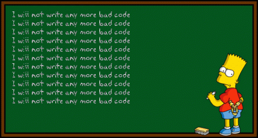

Every since I was a little kid I was always fascinated with computers. My parents actually told me they were worried about me because I would always spend so much time using it, admittedly to only play video games. It wasnʻt until my freshman year of high school when I seriously thought about what I wanted to do in my life. Around this time I started to play around with computer hardware. I also learned to code very simple things in HTML. My brother attended a high profile college majoring in computer science and he would always tell me about the things they did in his classes. Making programs and seeing your work be created right in front of you appealed to me a lot and in my senior year of high school I decided that I wanted to major in Computer Science.

My very first computer science course was ICS 111 which was pretty much a fast paced crash course using Java. I was afraid because I felt so young and inadequete. I barely knew anything about coding and people in the class who have obviously had experience coding before were shouting out answers left and right. Our final project was to make a music video using a speciality EZ animation class to make pictures move, rotate, and scale themselves to music. I remember the feeling of watching the final product, albeit very mediocre, and thinking of how amazing it was that we (our group) was able to code this entire thing. It felt like the project took hours upon hours but the end result was worth it. I still look back at the video because itʻs hilarious but also because it is something that I took pride in back then and it made me want to dive deeper into the field of computer science.

Since my freshman year of college I have taken many classes such as a dedicated C/C++ programming course, a database management course using SQL, and even an algorithms class. Although sometimes I struggled with some of the content of the courses, each and every class introduced to me to a wide range of topics. The classes I have taken so far have had topics that really reel me in. Constantly learning new things inspires me to learn more about computer science and software engineering. Now that I am taking an actual course labeled software engineering I hope to obtain skills and knowledge that will help me in my future career. 
