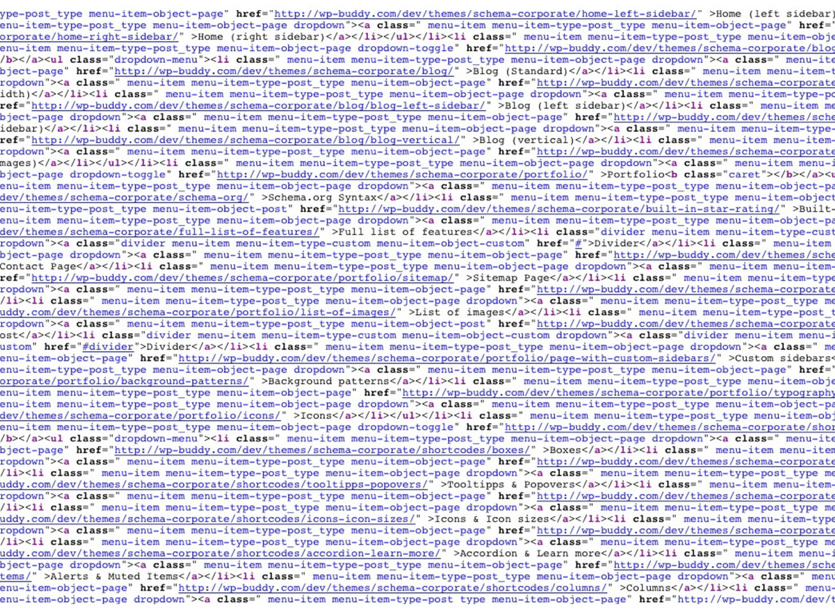

<p align="center">
  
</p>

## What is a UI Framework?

First of all, what is a UI Framework? UI stands for user interface and a UI Framework is a software tool to help you build a website that looks like a real website. There are many different frameworks such as [Semantic UI](http://semantic-ui.com/), [Bootstrap](http://getbootstrap.com/), and [Foundation](http://foundation.zurb.com/).

It won't do much if I just explain to you what a UI Framework is, visual examples are the easiest way to explain what UI Interfaces do.

For example, on the left is an example of a website built purely with HTML & CSS. Next to it there is an example of a website built using Semantic UI.

<p align="center">
  
</p>

```
let i = 10;
let j = 11;
i++
j
console.log(i , j); // i = 11, j = 11

```

But a simple whitespace left open can actually change a value of a variable you did not intend to change.

```
let i = 10;
let j = 11;
i
++
j
console.log(i , j); // i = 10, j = 12

```
ESLint will parse your code for unary operators and tell you to replace them with stricter rules

```
let i = 10;
let j = 11;
i += 1;
j -= 1;
console.log(i , j); // i = 11, j = 9
```
But when I finally get that green checkmark from ESLint after fixing my entire code, I get a sense of satisfaction knowing it probably won't screw up in the future due to syntax but because of my inability to code correctly.

## My Take on "Coding Standards"

I agree that the most useful software engineering technique to improve quality of your code is coding standards. Since almost every language has some sort of coding standard linter, I don't think there should be any excuse that your code will have problems running in the future because of a small mishap like putting in an extra whitespace. I don't believe that coding standards help you learn how to code but they do help you learn a language. Learning to code and learning to code perfectly in a certain language are two different things. Most code you write will run in some languages but all the code you write will not run perfectly unless you learn the ins and outs of the coding language.

But I do think there is another thing that is very important to learn as a software engineer. It's the ability to organize your code in a clear and concise manner so that when someone else reads you code they don't have to stare at your code for a bare minimum of 500 hours to understand what is going on. Unorganized code is probably my biggest pet peeve in computer science because not only does it make it hard for other people to read your code, but I don't even understand how the person writing it can read it either. 

<p align="center">
  
</p>

<p align="center">
  
</p>
