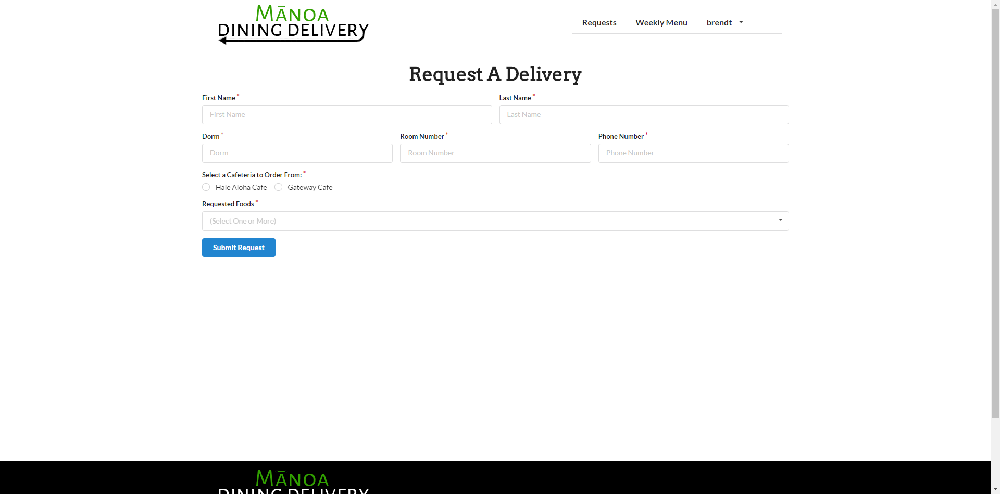
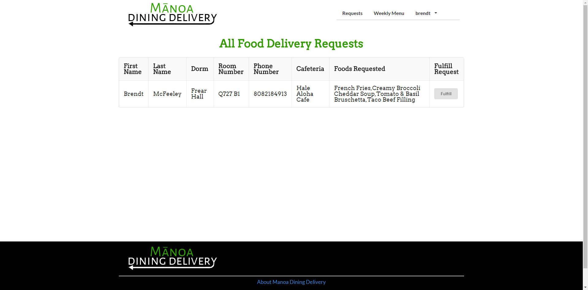

# What is LoveMilkTea?

[LoveMilKTea](https://devpost.com/software/ho-okele) is a cross platform mobile application built during the month long [Honolulu Annual Code Challenge](http://hacc.hawaii.gov/). With the help of my team, we took first place createing a mobile wayfaring guide for the University of Hawaii at Manoa.

# The Challenge

Garret Yoshimi, the vice president of ITS pitched his idea for a wayfaring guide for the University. We knew the university had a map with points of many of the buildings of the campus but it was not easily accessible, did not have every point of interest, and most importantly of all it was not mobile friendly. We wanted to provide the students of the University with a complete mobile friendly application that provides information, directions and much more.

## Simple Overview of Manoa Dining Delivery

Our application features a simple UI :

  

Having a very straight forward UI removes clutter and makes the intentions of the application clear.

Once logged in, students are able to create a delivery request! Students are only able to create requests when the cafes are open to make sure the application does not
get cluttered by unfulfilled requests. 

  

To view all requests users need to do is navigate to the requests, fulfill tab. Once there you can see all active requests and decide to fulfill it. All information is
clearly displayed and easy to read. 

  

## Contributions

All members of our team were responsible for creating this project. But we quickly learned that each of us has certain strengths when it came to creating the app. The majority of my work
dealt with the frontend of our website. I made sure that the design of the application was modern, easy to use, and appealing to the eyes. A lot of time was spent studying a lot of big websites to
understand how they layed out the content of their websites. I decided to style the application around the central idea of our application, which is food delivery. I was also in charge of
logo design.

Although a majority of my work was done on the front end, I did end up working on the backend too, mainly working with our implementation of SweetAlert. We used SweetAlert in place of an actual
profile page because we felt a profile page was not beneficial to a food delivery application. Thus implementation of SweetAlert made perfect sense.

## What Have I Learned?

This web application was the second one I've built (first one being an AT&T hackathon). One of the best lessons I've learned is using Git in a project setting. I've learned the correct way to manage a project with other people. Organization of the project with issues and milestones made working on the project 1000% easier. Comparing this to my hackathon experience where we were all committing to master and running into problems where our code kept overwriting each other.

I also learned a lot about frontend development. Developing a functioning website from scratch taught me a lot about how divisions work with each other. I also learned how important responsiveness and UI is to a website. Evne though I focused a lot on the front end development I learned a lot about backend JavaScript development and database management.
