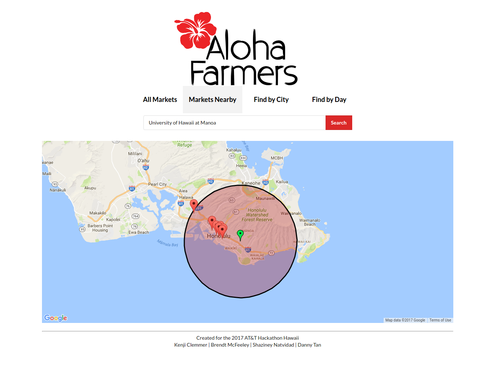

  

Aloha Farmers is a web application that I helped create during the AT&T Hackathon in March 2017. Building this application helped me gain a large insight on Meteor and the use of APIs in appliations.

Aloha Farmers was created using [Meteor](https://www.meteor.com/), a JavaScript application platform. In only twenty four hours, our team of four created this web application that uses a Hawaii Farmers Market databse API to display all the farmers markets throughout Hawaii by island and city, and also by which days certain markets are open. We also have a Nearby Markets tab which implements the Google Maps API to display all farmers markets within 7 miles of an addressss, zip, or city.

In this project I learned the entire process and work that goes into building a fully functional application. I learned how to use [MongoDB](https://www.mongodb.com/) for database storage, (Semantic UI)[https://semantic-ui.com/) for CSS Framework and user interface, as well how client and servide-side programming interacts with JavaScript. Lastly I learned how important it is to lay out the foundations of your application and what should be the basic functions.
