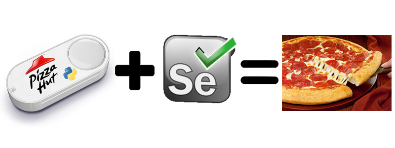

  

AutoPizzaHut is a [Python](https://www.python.org/) based script I wrote to automatically order Pizza Hut with a single click of an Amazon Dash Button! This was my first project written in Python and it helped me get familair with the language as well as how to integrate various APIs within Python.

To create AutoPizzaHut, I used [Amazon's Dash IOT Dash Button](https://aws.amazon.com/iotbutton/) along with [Selenium](http://www.seleniumhq.org/) web browser automation webdriver in order to script Pizza Hut Hawaii's page. My goal for this project was to have all of the customer/user data in one handy JSON file and have my program read off of it. The JSON included the customer info, credit card, favorite order, and dash button MAC Address.
Reading all the data from one central point makes it user friendly and easy to use. To add I created my own API that corresponds to every food option and topping on Pizza Hut's website. All you need to do is find the code for your food and toppings and run the script.

Creating this project, I learned how web automation works and how useful it can be in certain projects. I also learned the importance of JSON/APIs. Although writing an API from scratch took a while, it made the user experience a lot smoother.

More information as well as the GitHub repository can be found here : https://github.com/brendtmcfeeley/autoPizzaHut
