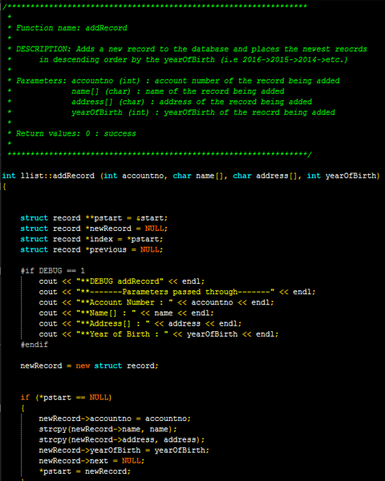

This is a program that I developed for my ICS 212 class in Fall 2016. This project helped me learn how to design programs in C and C++ and how to implement data structures such as structs.

This program was originally written using [C](http://www.tutorialspoint.com/cprogramming/c_overview.htm?), then rewritten later using [C++](http://www.cplusplus.com/doc/tutorial/). We were given around two weeks to complete each project. Although some code is reused in the C++ implementation, we used objects along with structs and added in extra functions such as a recursive reverse function.

I gained valuable skills while devloping this program. One of the most important skills I learned is the importance of a user friendly UI. The easier you make the program for a user, the less problems you will have to troubleshoot. I also learned a lot about time management and the importance of objects and class hierarchy.
