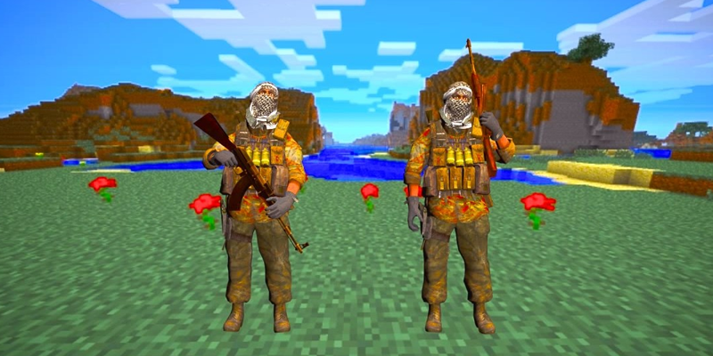

This is a video I produced in my sophmore year of high school. I attempted to learn the basics of 3D animation by extracting models from various games and mashing them together to create a video of some sort.

[The video/animation]https://www.youtube.com/watch?v=9HMBhPT4rRE) was done using [Cinema4D](https://www.maxon.net/en/), which is a animation environment where you can move objects around using a process called keyframing. This animation also required me to extract models from certain games (Call of Duty 4, Minecraft, etc.) and import their texture files in order to attach them to a skeleton in Cinema4D.

In this project I gained fair knowledge of how computers manage memory when rendering objects or animations. I had to make sure I allocated enough memory for the program since it was very CPU and RAM intensive. I researched a little information in 10th grade in so I could get my work done faster. I would love to pick up animation again as a hobby, but I would do it differently. The main difference would be the things I animate, I would actaully want to animate things people would want to see.
