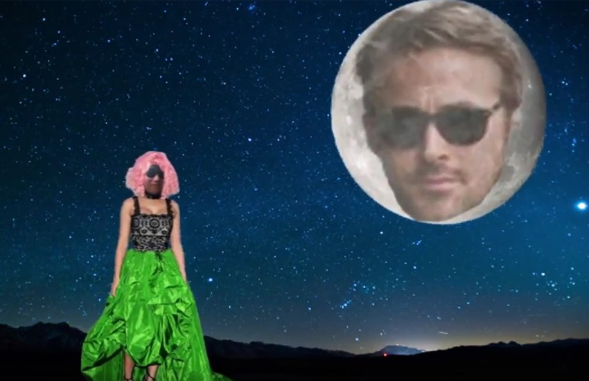

[This video](https://www.youtube.com/embed/kyawH1BredQ) was the final project for our ICS 111 class which was our first introduction to Java and to programming. Doing this project helped me learn the basics of object oriented programming.

I learned the fundamentals of programming from this course such as using simple class hierarchy in Java and how use different data types such as int, char, string, and booleans. I also learned how to evenly distribute workload within a group since there were five people assigned to one group. We learned colalbortion with others is a very crucial aspect to computer science.
